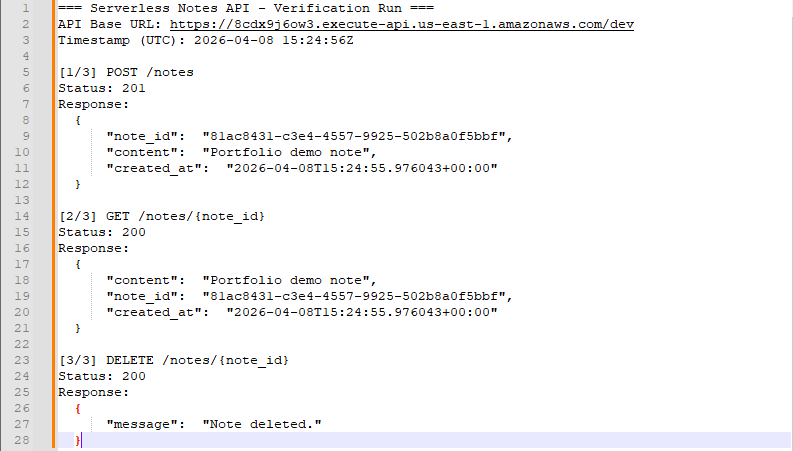

# serverless-notes-api

## Project Summary
Serverless notes API on AWS using API Gateway, Lambda (Python), and DynamoDB, with endpoints for creating, retrieving, and deleting notes. Automated infrastructure deployment and teardown with Python/boto3 scripts, and validated functionality with end-to-end API tests (POST/GET/DELETE).

## Architecture Overview
- API Gateway routes requests to Lambda.
- Lambda handles note CRUD operations.
- DynamoDB stores note items by ID.

## AWS Services Used
- Amazon API Gateway (REST API)
- AWS Lambda (Python)
- Amazon DynamoDB

## Deployment Instructions
1. Install dependencies: `python -m pip install -r requirements.txt`
2. Configure AWS credentials (for example, `aws configure`)
3. Deploy the stack: `python deploy.py`

The deploy script prints the API base URL.

## Example Requests
Replace `API_URL` with the base URL from deploy (for example: `https://abc123.execute-api.us-east-1.amazonaws.com/dev`).

- Create a note:
  - `curl -X POST "$API_URL/notes" -H "Content-Type: application/json" -d "{\"content\":\"Buy milk\"}"`
- Get a note:
  - `curl "$API_URL/notes/NOTE_ID"`
- Delete a note:
  - `curl -X DELETE "$API_URL/notes/NOTE_ID"`

## Cleanup Instructions
Run: `python cleanup.py`

## Concepts Used/Learned
- API Gateway route configuration for HTTP methods and resource paths.
- Lambda request handling for create, read, and delete note operations.
- DynamoDB item writes and reads using note IDs as keys.
- Automated deployment and cleanup workflows using `boto3` scripts.

## Example Output
Sample API test results screenshot (POST, GET, and DELETE success flow):

